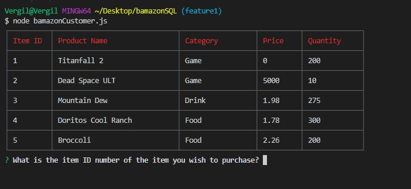
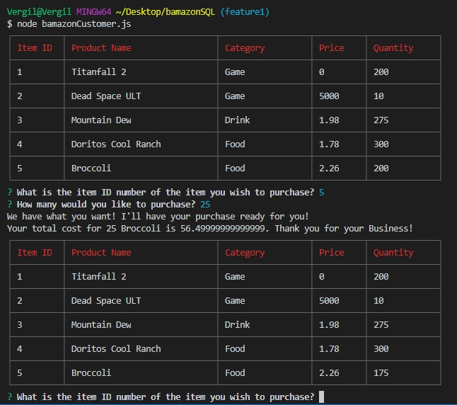
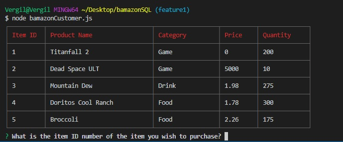

# bamazonSQL

# What is Bamazon?

Bamazon is an App that immitates the functions of amazon by displaying its information on node in a table, you are given the option to purchase items on the table and what amoun you want. The database of the table is then updated when the user chosses items.

# How does it work?.

  * Starting the app should give you a console view like this
   
  
  * After inputing your values into the questions the application does the math for the total for you.
  
  
  * When you start the application again the values of the table stay changed based upon previous user inputs.
    

  * Here is a gif showing the whole process.
  
  

# Instructions on how to use Bamazon

  * Open Your terminal such as bash or vs code terminal
  * Follow console prompts
  * Enjoy your purchase and witness the data change!
  
# Software to create Liri

javascript, 
VS code, 
GitBash, 
Git, 
NodeJS
